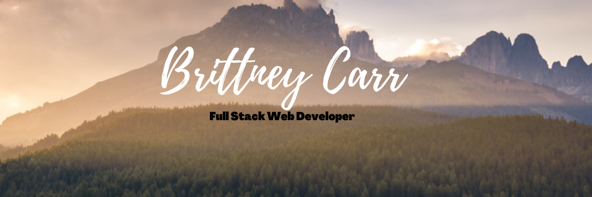

### Hi 👋🏾 I'm Brittney..👩🏽‍🦱

I'm from Atlanta, Ga, and I am an inspiring Full Stack Web Developer. I have a wide variety of experience ranging from software development, electricity, research, military, engineering and project management. With my experience, I come with a vast set of skills and knowledge needed to make your project a success. I thoroughly enjoy all aspects of designing an application, and get very excited to collaborate and discuss ideas with others to build and deliver a product that does everything it was created to do.

Skills: VUE JS / REACT / JS / HTML / CSS

- 🔭 I’m currently working on this page. 
- 🌱 I’m currently learning Node.

    

